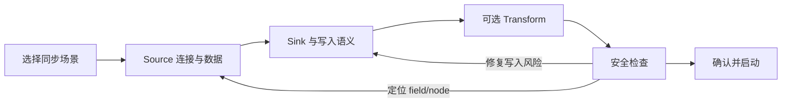

# OpenETL-Go Web UI 重构方案

> 版本：2026-07-20；依据：`web/screenshots/*`、当前 React/Tailwind 实现、`docs/ROADMAP.zh.md` P4。本文是设计与实施基线，不引入独立于 pipeline spec 的产品模型。

## 1. 设计结论

将当前“功能目录式工程控制台”重构为围绕三件事展开的任务型产品：

1. **创建成功**：用户沿 `Source → Transform → Sink` 完成连接、数据范围、写入语义和安全检查。
2. **稳定运行**：用户先看到需要处理的 pipeline，而不是累计数字。
3. **快速修复**：问题必须能从总览定位到 pipeline、node、field，并完成修复、重启或 replay。

保留现有 React、Tailwind、Radix、xyflow、YAML/API/UI 共用 spec 的技术边界。**Designer / DAG 编排没有删除**：它从与仪表盘同级的一级产品入口，降级为 Pipeline 的创建/编辑与高级工作区。Schedule 属于 pipeline 生命周期；Worker 只在 distributed 模式突出显示。

可浏览全页面视觉草案见 [UI-REDESIGN-PROTOTYPE.html](./UI-REDESIGN-PROTOTYPE.html)（含总览、管道列表/详情、向导、问题中心、DLQ、Connections、Connector catalog、审计、Cluster、高级 DAG、设置）。

## 2. 截图审计

| 区域 | 当前证据 | 用户成本 | 重构方向 |
|---|---|---|---|
| 全局导航 | 仪表盘、管道、连接、设计器、DLQ、内置、WASM、Worker、Schedule、Audit 同层 | 用户需要先理解内部模块，才能完成任务 | 收敛为“总览、管道、运维、资源、系统”分组 |
| 总览 | 5 个等权指标卡；运行数被用于推导 healthy；累计读写占据首屏 | “现在要做什么”不明确，健康口径不可信 | 首屏呈现问题队列、运行健康与快捷动作 |
| 管道列表 | 名称/标签/按钮为主；Source/Sink、模式、写入语义、最近错误缺失 | 无法扫一眼判断风险或定位失败 | 列表行直接表达数据路径、运行方式、健康与最近问题 |
| 管道详情 | 常驻右栏堆放指标，信息空间窄；详情与列表耦合 | 指标缺少时间范围，故障处理路径断裂 | 使用稳定详情路由和 Overview/Runs/Issues/Checkpoints/Spec 标签 |
| Designer / DAG | 作为一级导航与总览同权；节点库、调度、钩子、AI、YAML 平铺在双层工具条 | 新手先面对节点库而非任务；DAG 像独立产品线 | **不删除能力**。创建走分步向导；多源/路由/fanout 仍用画布，但入口改为「管道详情 → 高级 DAG 编辑」 |
| Connection | “目录”和“新建表单”并排，能力成熟度与连接实例混杂 | 不清楚是在选 connector 还是创建实例 | 分成 Connections（实例）与 Connector catalog（能力） |
| DLQ | 先选 pipeline，再显示记录；空态仍暴露重放/全删 | 缺少错误聚合、影响范围和修复闭环 | 按 error class/node/time 聚合，先修复再 replay |
| Worker/插件 | standalone 用户仍看到 Worker；内置与 WASM 同权 | 平台实现细节干扰日常任务 | 归入系统/扩展，按运行模式与权限渐进披露 |
| 视觉系统 | Inter、蓝紫主色、等半径白卡、emoji 与 Lucide 混用 | 层级弱、控制台模板感强、状态依赖颜色 | 中性冷灰 + 单一青绿色；数据用 tabular nums；统一图标与状态文案 |

## 3. 新信息架构

```text
总览  /overview
├─ 待处理事项
├─ 运行态势
└─ 最近活动

管道  /pipelines
├─ 全部管道
├─ 新建管道  /pipelines/new
└─ 管道详情  /pipelines/:id
   ├─ Overview
   ├─ Runs
   ├─ Issues
   ├─ Checkpoints
   └─ Spec & versions

运维
├─ 问题中心  /issues
├─ DLQ  /dlq
└─ 审计  /audit

资源
├─ Connections  /connections
└─ Connector catalog  /connectors

系统
├─ Cluster / Workers（仅 distributed）
├─ Extensions（WASM）
└─ Settings
```

桌面端左栏宽 248px，可折叠为 68px；导航组可折叠，但“总览、管道、新建管道”始终可见。顶部栏只保留面包屑、全局搜索/命令入口、通知与用户设置。语言、主题、重载配置移入用户菜单或系统设置，避免抢占日常操作。

## 4. 核心任务流

### 4.1 首次创建



向导使用独立路由 `/pipelines/new?step=source`，而不是长弹窗。左侧为 6 步进度，中间为当前任务，右侧为始终可见的 pipeline 摘要。每一步自动保存草稿，刷新与前进/后退不丢失状态。

- 场景：只选择目标，如“数据库 CDC 到分析库”“Kafka 清洗后入库”；模板只预填 spec，不创造新语义。
- Source：先选已保存 Connection，再选库表/topic；就地展示 health、schema、sample、checkpoint 能力。
- Sink：突出 target、主键、`insert/upsert/pre_write`、auto-create、DDL preview 和 replay 重复边界。
- Transform：默认跳过；使用有序 stage 列表，支持逐阶段 dry-run，错误绑定到 stage/field。
- 安全检查：按步骤分组展示 blocking error、warning、recommendation；每条都有“返回并修复”。
- 确认：用一条清晰的 `Source → Transform → Sink` 路径总结调度、幂等、DDL、checkpoint、DLQ 和已知风险。

### 4.2 日常巡检

进入总览后先看到“需要处理”，顺序固定为：failed → degraded → DLQ backlog → lag/checkpoint → connection/worker。每条事项展示对象、影响、开始时间、建议动作；点击直接进入 `/pipelines/:id/issues?issue=...`。

累计吞吐量降为二级信息，并明确时间范围（最近 15 分钟、24 小时、累计）。健康度由期望状态、实际状态、lag、checkpoint、DLQ 和最近错误共同派生，不再以 running/total 计算。

### 4.3 故障与 DLQ replay

`问题中心 → Pipeline Issues → 编辑修复 → Preflight → Replay/Restart → 结果核对`。Replay 确认中必须显示：目标记录数、筛选范围、sink 幂等模式、可能重复边界。执行结果显示成功、失败和剩余 backlog，不能只发 toast。

## 5. 页面规格

### 总览

- 顶部：问候/环境、时间范围、`新建管道` 主动作。
- 第一行：问题收件箱（占 2/3）+ 系统状态（占 1/3），避免五张等宽卡。
- 第二行：pipeline health 分布、吞吐/lag 趋势、最近运行。
- 空环境：不显示 0 值墙；展示三步 getting started：创建 connection、创建 pipeline、验证首批数据。

### Pipeline 列表

- 顶栏：搜索、状态、模式、connector、owner/tag 筛选；筛选进入 URL query。
- 每行从左到右：健康状态与名称；`Source → Transform → Sink`；batch/CDC 与 schedule；lag/DLQ/最近运行；主要动作。
- 默认主动作是“查看问题”或“打开详情”。Start/Stop 不再用无标签图标占据每一行，放入上下文动作并按状态显示。
- 批量操作进入 selection toolbar，明确选中数量与影响。

### Pipeline 详情

- 头部：返回、名称、环境/标签、派生健康状态、Start/Stop/Run now、更多。
- Overview：数据路径、当前运行、核心 SLI、最近问题、下一次调度。
- Runs：每次执行的时间、结果、读写失败、checkpoint、日志入口。
- Issues：按严重度和 node/field 聚合，内联 remediation。
- Checkpoints：当前位置、年龄、最后提交；reset 是危险动作并说明 replay 后果。
- Spec & versions：表单/YAML 双视图、diff、版本恢复；保证隐藏字段往返。

### Connections 与 Connector catalog

Connections 只展示实例、health、引用 pipeline、最后测试时间；新建/编辑使用抽屉或独立路由。Connector catalog 展示支持的 source/sink、成熟度、能力与文档，不与实例表单挤在同一屏。

### 高级 DAG 编辑器（能力保留，导航降级）

#### 为什么看起来像“删了 DAG 编排”？

不是删除，而是**信息架构降级**：

| 维度 | 现状（问题） | 重构后 |
|---|---|---|
| 导航位置 | 一级项 `设计器`，与仪表盘/管道并列 | 二级：管道详情头部「高级 DAG 编辑」，或向导确认页「打开画布」 |
| 产品语义 | 用户以为 OpenETL 是“画布编排平台” | 主表面仍是 `Source → Transform → Sink`；DAG 是同一 spec 的高级拓扑视图 |
| 与 ROADMAP 关系 | 易演变成独立产品线 | 对齐 `docs/ROADMAP.zh.md`：DAG/调度/分片/master-worker **扩展**线性模型，不另开产品 |
| 能力范围 | 保留 xyflow 画布、条件路由、fanout、节点属性、YAML 往返 | **全部保留**；只调整入口、工具条密度与空态 |
| 删除节点 | 常驻危险按钮 | 仅选中节点后出现 |

后端 `internal/etl/orchestrator`、节点级 DLQ replay、DAG YAML 加载/hot-reload **不受 UI 降级影响**。UI 仍读写同一份 pipeline/DAG spec。

#### 画布规格

画布使用三段式布局：左侧节点库（可搜索、分 Source/Transform/Sink）；中央画布；右侧选中节点属性。顶部只保留返回、名称、undo/redo、验证、保存。Schedule、YAML、AI 辅助进入二级面板；删除只在选中节点后出现。空画布提供“从 Source 开始”与模板，不展示一排彩色节点按钮。

## 6. 交互与状态规范

统一展示状态：`healthy / degraded / failed / paused / scheduled / completed`。每个状态同时使用图标、文本与颜色；失败记录数、失败 pipeline 数、当前 DLQ backlog、历史 replay 数分别命名。

- Loading：保留页面结构的 skeleton，自动刷新不得清空旧数据。
- Empty：解释为什么为空，并给一个与上下文一致的下一步。
- Error：错误靠近对象/字段；顶部仅汇总。保留用户输入，支持 retry。
- Success：说明完成对象与结果，如“已重放 1,248 条，3 条仍失败”。
- 危险动作：确认页包含对象、数量、影响、不可逆性；删除/reset 可要求键入名称。
- 键盘：可点击行使用真实 link/button；所有图标按钮有 label；focus ring ≥ 2px；画布外提供可操作的节点列表。
- Motion：hover 160ms、panel 220ms、page 280ms；只动 transform/opacity，并尊重 reduced motion。

## 7. 视觉系统

视觉目标是“可靠的自托管数据运行台”，不是通用 SaaS 模板。

| Token | Light | Dark | 用途 |
|---|---|---|---|
| canvas | `#F4F7F6` | `#0C1211` | 页面底色 |
| surface | `#FFFFFF` | `#131C1A` | 主要工作面 |
| ink | `#17211F` | `#E7EFEC` | 主文本 |
| muted | `#62706C` | `#91A19C` | 辅助文本 |
| accent | `#157A68` | `#45B59E` | 唯一品牌强调色 |
| danger | `#C74646` | `#EF7772` | blocking/failure |
| warning | `#A96918` | `#D9A24C` | degraded/risk |

- 字体：界面优先 `Geist, "Noto Sans SC", sans-serif`；数字与 ID 使用 `Geist Mono` 或 `font-variant-numeric: tabular-nums`。允许系统字体回退，首期不必增加运行时依赖。
- 容器：内容最大宽度 1520px；数据页面使用 24–32px gutter。卡片只在表达层级时使用，不把每个数字都包成等高白卡。
- 圆角：工作面 14px、控件 8px、标签 5px；不统一成 pill。
- 阴影：仅浮层使用带青灰色相的阴影；常驻区域以 surface 层级和细分隔线组织。
- 图标：继续使用现有 Lucide 以控制实施成本，但移除 emoji 和文本符号按钮，统一 1.75px stroke。

## 8. 响应式

- ≥1280px：完整侧栏；列表与上下文面板并列。
- 768–1279px：折叠侧栏；详情作为全页或右侧 sheet；筛选可换行。
- <768px：底部主导航仅保留总览、管道、问题、更多；表格改为信息行；危险动作不与主动作并排；Designer 提供只读概览和节点列表，复杂拖拽提示使用桌面端。

## 9. 实施顺序

1. **P4.1 状态可信度**：建立派生 health view model；统一文案、图标、危险动作与可访问性。
2. **P4.3 路由与 IA 基础**：引入稳定 URL、导航分组、pipeline 详情 tabs；不先做纯视觉换皮。
3. **总览与列表**：改为问题优先，补数据路径/模式/写入语义/最近错误。
4. **P4.2 分步创建**：把现有 wizard 能力迁移到路由式步骤，保留 spec 往返和 preflight。
5. **DLQ 闭环**：问题聚合、修复跳转、replay 结果与剩余 backlog。
6. **视觉与响应式收口**：tokens、排版、loading/empty/error、暗色和小屏。

建议组件边界：`AppShell`、`TaskNavigation`、`PipelineHealthBadge`、`PipelinePath`、`IssueInbox`、`IssueDetail`、`ImpactConfirm`、`PipelineWizardLayout`、`PreflightPanel`、`RunTimeline`。状态派生放在共享 domain/view-model 层，页面不得各自计算健康度。

## 10. 原型页面对照

首稿原型只画了「总览 + 创建向导」两屏，用于快速对齐问题优先总览与分步创建主路径，**不是**最终范围。完整草案现覆盖：

| 原型页 | 路由意图 | 对应现网页面 |
|---|---|---|
| 总览 | `/overview` | `DashboardPage` |
| 管道列表 | `/pipelines` | `PipelinesPage` |
| 管道详情 tabs | `/pipelines/:id/*` | 列表右栏拆出 |
| 新建管道向导 | `/pipelines/new` | `first-task-wizard` |
| 问题中心 | `/issues` | 新建（从 metrics/DLQ/status 派生） |
| DLQ | `/dlq` | `DLQPage` |
| Connections | `/connections` | `ConnectionsPage` 实例侧 |
| Connector catalog | `/connectors` | `ConnectionsPage` / plugins 能力侧拆分 |
| 审计 | `/audit` | `AuditPage` |
| Cluster / Workers | `/cluster` | `WorkersPage`（仅 distributed 主导航） |
| 高级 DAG 编辑 | `/pipelines/:id/editor` | `DagEditorPage`（**降级入口，不删**） |
| 设置 | `/settings` | `SettingsPage` + 主题/语言/token |

浏览器直接打开 `docs/UI-REDESIGN-PROTOTYPE.html` 即可点选切换上述页面。

## 11. 验收清单

### 11.1 路由可达（IA 基础）

下列项表示 **功能入口与路由已通**，不等于像素/交互已与 `UI-REDESIGN-PROTOTYPE.html` 完全对齐：

- [x] 总览、列表、详情对 paused/scheduled/completed/failed/degraded 的表达一致（`lib/pipeline-health.ts` 统一派生）。
- [x] 失败 pipeline、失败记录、DLQ backlog 和历史计数不混用，指标均有时间范围（总览区分 15m 健康 vs 累计吞吐）。
- [x] 可从空环境不编辑 YAML 完成 Connection → Source → Sink → dry-run → preflight → 创建启动（FirstTaskWizard 入口 `#/pipelines/new`）。
- [x] `/pipelines/:id` 及其 runs/issues/checkpoints/spec 上下文刷新、前进/后退可恢复（hash 路由 `#/pipelines/:id/:tab`）。
- [x] failed/degraded/DLQ 可从总览进入具体问题/DLQ，replay 结果展示剩余 backlog（问题中心 + DLQ 聚合）。
- [x] UI/YAML/API spec 往返不丢字段；建议仍来自 descriptor/introspection/preflight（Designer/向导未改合约）。
- [x] standalone 不暴露 Worker 主入口（workers≤1 隐藏）；distributed 可进入 Cluster；e2e 仍可通过隐藏 `data-nav` 兼容锚点访问。
- [x] 中文关键路径更新（总览/问题中心/新建管道）；健康态图标+文本+颜色；focus-visible ring。

### 11.2 原型对齐（任务流与视觉）

- [x] 管道列表全宽：去掉常驻 master-detail 右栏；行结构含健康/路径/模式/信号/主动作；Start/Stop 进更多菜单；筛选写 URL query；emoji 控件改为 Lucide。
- [x] 新建向导为 `#/pipelines/new` **全页**三段式（左 6 步 / 中表单 / 右摘要）；`?step=` + localStorage 草稿；确认页「打开高级 DAG」。
- [x] DLQ 主视图按 error class/node/time 聚合，样本二级展开；右侧 Replay 确认面板（目标数/筛选/幂等/边界）；dry-run 与结果展示；空 backlog 隐藏危险主按钮。
- [x] 详情 Overview 含写入语义卡 + 生命周期卡；SLI 标明时间范围；Runs 历史表 + empty note；Spec 表单/YAML 双视图 + versions。
- [x] 总览时间范围可切换 15m/24h/累计；吞吐与健康分离；关键管道行含路径/模式/信号。
- [x] Connections 列表与新建/编辑抽屉分离；Catalog 能力只留 `/connectors`；指标色用 primary。
- [x] 问题中心固定排序 failed → degraded → DLQ → lag/checkpoint；含对象/影响/建议动作；`?issue=` 深链参数。
- [x] 顶栏：面包屑 + 全局搜索 + 通知占位 + 用户菜单（语言/主题/重载下沉）；扩展分组；Schedules 系统下沉。
- [x] 高级 DAG：删除仅选中后出现；emoji 工具按钮清理；Schedule/YAML/AI 仍走二级 drawer。
- [x] 设计 tokens 全站青绿 primary；表格/ID tabular-nums；内容 max-width ~1520px。
- [ ] 响应式底栏「更多」完整信息行折叠与 DAG 只读概览（中小屏基线已有，细项仍可增强）。
- [x] Playwright e2e：`hack/e2e-ui.sh` **108 passed, 0 failed**（全宽列表、向导全页、DLQ 空态不露危险按钮、导航文案、语言切换/重载/自动刷新）。

### 实施落点（2026-07-21 原型对齐批次）

| 能力 | 文件 |
|---|---|
| Health view-model / 问题排序 | `web/src/lib/pipeline-health.ts` |
| Hash 路由 | `web/src/lib/routing.ts`, `web/src/main.tsx` |
| 分组导航 / AppShell 顶栏 | `web/src/components/layout/app-shell.tsx` |
| 视觉 tokens | `web/src/styles.css`, `web/tailwind.config.ts` |
| 总览时间范围 | `web/src/pages/DashboardPage.tsx` |
| 问题中心 | `web/src/pages/IssuesPage.tsx` |
| 管道详情 tabs 加深 | `web/src/pages/pipelines/PipelineDetailPage.tsx` |
| 全宽列表 + 筛选 URL | `web/src/pages/pipelines/PipelinesPage.tsx` |
| 全页三段式向导 | `web/src/pages/pipelines/first-task-wizard.tsx` |
| Connections 抽屉 | `web/src/ConnectionsPage.tsx` |
| Connector catalog | `web/src/pages/ConnectorsPage.tsx` |
| DLQ 聚合 + Replay 面板 | `web/src/pages/DLQPage.tsx` |
| 高级 DAG 工具条 | `web/src/DagEditorPage.tsx` |
| i18n | `web/src/i18n.ts` |
| e2e | `hack/e2e-ui.sh` |
| 原型对齐 backlog | `docs/UI-REDESIGN-TODO.zh.md` |

